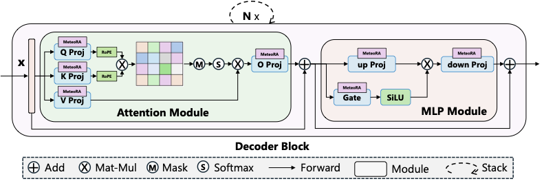
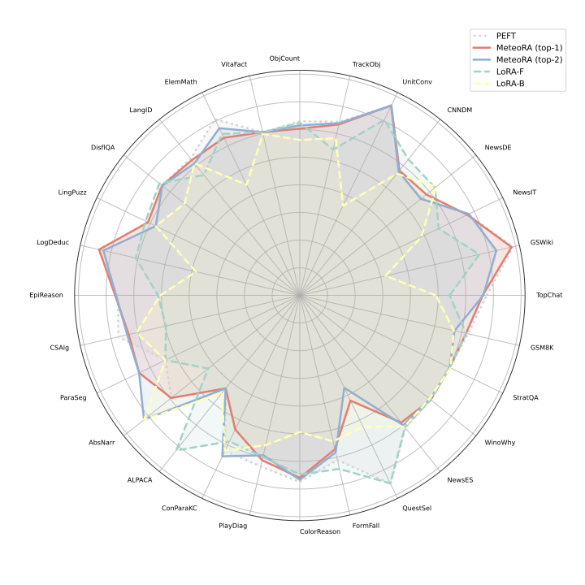
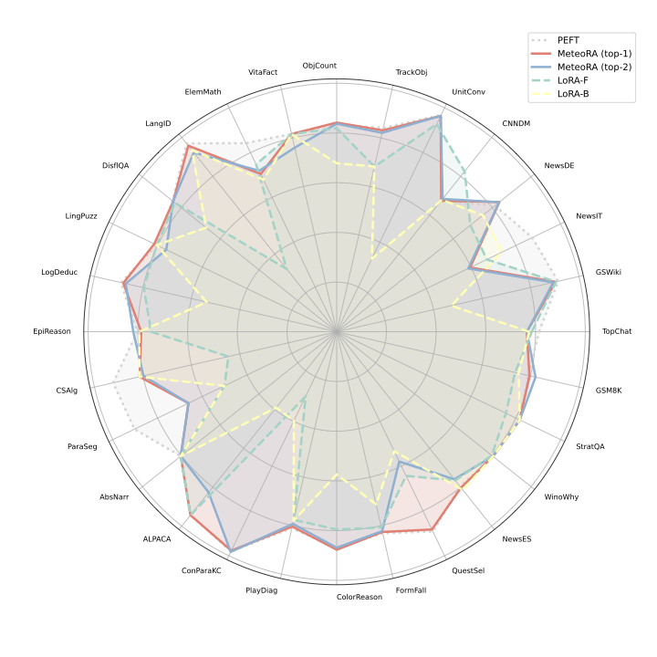
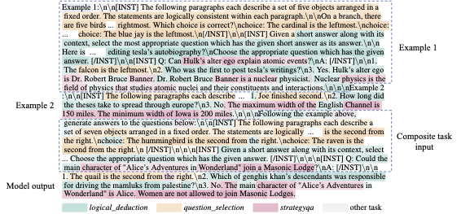

# MeteoRA: Multiple-tasks Embedded LoRA for Large Language Models

This repository contains the implementation of the [paper](https://arxiv.org/abs/2405.13053) "MeteoRA: Multiple-tasks Embedded LoRA for Large Language Models".




## Overal performance

### General performance of MeteoRA embeded LLMs with 28 LoRA adapters

We successfully apply MeteoRA to both LlaMA2-13B and LlaMA3-8B. Each model equips 28 tasks embedded in 28 LoRA adapters, respectively. 
The performance of MeteoRA is comparable to the state-of-the-art. Refer to our paper for the detailed information of evaluation settings.

<!-- Evaluation results of models based on LlaMA2-13B:


Evaluation results of models based on LlaMA3-8B:
 -->

<table>
  <tr>
    <td></td>
    <td></td>
  </tr>
</table>
&nbsp;&nbsp;&nbsp;&nbsp;MeteoRA with LlaMA2-13B    &nbsp;&nbsp;&nbsp;&nbsp;&nbsp;&nbsp;&nbsp;&nbsp;  MeteoRA with LlaMA3-8B


### Example of *composite-3* tasks
We highlight the statistically dominant LoRA selected by MeteoRA in token level (decoded to words). The result shows that LLM with MeteoRA could achieve timely LoRA switching on both phases of input understanding and output generation. The background color gets darker when Gating network assigns a higher weight value.


## Directory structure

- `base_model`: Contains the MeteoRA model.
- `ckpt`: Contains the datasets and dataset processing code.
- `eval`: Contains the evaluation results and evaluation code.
- `MoELoRA`: Contains the MeteoRA module and adapted PEFT code.

## Usage

### Preparation

1. Install necessary packages:
      ```shell
      pip install -r requirements.txt
      ```

2. Prepare the datasets. MeteoRA requires datasets in JSONL format. The tasks are primarily selected from the BIGBench dataset in the paper, which is in JSON format. To convert them to JSONL format, run:
      ```shell
      cd data
      python create_dataset.py --task all
      ```

   To create a specific dataset, use:
      ```shell
      cd data
      python create_dataset.py --task <task_name>
      ```

3. Prepare *composite-n* tasks. Refer to our paper for the definition of *composite-n* tasks. Generate these tasks using:
      ```shell
      python create_composite.py --n <n>
      ```
      We prepared `n=3`, `n=5` and `n=10` few-shot dataset generating code. Before generation, please ensure that the sub-tasks to composite *composite-n* task have been included in `data/datasets`.

4. Prepare LoRA adapters and MeteoRA model checkpoints. You can train them yourself or download ours pre-trained models ([MeteoRA with LlaMA2](https://huggingface.co/ParagonLight/MeteoRA-llama2-13b) and [MeteoRA with LlaMA3](https://huggingface.co/ParagonLight/MeteoRA-llama3-8b) as base model):
      ```shell
      python download_ckpt.py
      ```

5. Update file paths in `configs/config.yaml`. Example paths:
      ```yaml
      base_model_path: 'meta-llama3/Meta-Llama-3-8B'
      meteora_ckpt_path: 'ckpt/llama3_8b/llama3_8b_meteora/top_2'
      adapter_dir: 'ckpt/llama3_8b/llama3_8b_peft'
      ```

### Evaluation

Run a benchmark with the MeteoRA model:
```shell
python eval_model.py --task <task_name> --batch_size <batch_size> 
```

For example:
```shell
python eval_model.py --task composite_10 --batch_size 4 
```

**Note:** For *composite-n* tasks, set a larger *temperature* value (`self.T` in `MoELoRA/layer.py`). Use `15`, `20`, and `30` for `n=3`, `n=5`, and `n=10`, respectively. For single tasks, use the default value (`self.T=1`).


To save the evaluation result:
```shell
python eval_model.py --task <task_name> --batch_size <batch_size> --save
```

For debug mode (model output and ground truth will be shown in the console):
```shell
python eval_model.py --task <task_name> --batch_size <batch_size> --debug
```

Run a benchmark with the PEFT model:
```shell
python eval_model.py --task <task_name> --batch_size <batch_size> --model <adapter_name>
```

### Training the MeteoRA Model

0. Prepare LoRA adapters and corresponding datasets in JSONL format. Ensure each LoRA adapter has a corresponding dataset. Place all LoRA adapters and datasets in their respective folders with matching subfolder names:
      ```
      - lora_adapters
            - adapter_name1
            - adapter_name2
            - ...
      - datasets
            - dataset_name1
            - dataset_name2
            - ...
      ```

1. Update file paths in `run_meteora_train_fsdp.sh`.


2. Train the MeteoRA model:
    ```shell
    sh run_meteora_train_fsdp.sh
    ```

**Note:** The current version of Triton acceleration supports inference mode only. Use the following settings when training the MeteoRA model:

```shell
export MOELINEAR_USE_ACCELERATE_FWD=0
export MOELINEAR_FWD_INNER_LOOP_MODE='batch'
export MOELINEAR_ACCELERATE_FWD_BACKEND='torch'
export MOELINEAR_ACCELERATE_FWD_BACKEND_TORCH_VERSION='v1'
```


### Evaluation Results

#### *composite-n* results

The *composite-10* evaluation results are presented in details with MeteoRA results on the left side and LoRA-B results on the right side of each metric column. A dash ('-') indicates that the corresponding metric was not applicable or included in the evaluation. Note that the `0.00` BLEU scores are caused by mismatch and too insufficient answers.

| Sub-task Name                  | Accuracy↑ (MeteoRA) | Accuracy↑ (LoRA-B) | BLEU↑ (MeteoRA) | BLEU↑ (LoRA-B) | ROUGE-1↑ (MeteoRA) | ROUGE-1↑ (LoRA-B) | ROUGE-2↑ (MeteoRA) | ROUGE-2↑ (LoRA-B) | ROUGE-L↑ (MeteoRA) | ROUGE-L↑ (LoRA-B) |
|--------------------------------|---------------------|--------------------|-----------------|----------------|---------------------|--------------------|---------------------|--------------------|---------------------|--------------------|
| logical_deduction              | 0.500↑             | 0.453              | -               | -              | -                   | -                  | -                   | -                  | -                   | -                  |
| question_selection             | 0.703↑             | 0.688              | -               | -              | -                   | -                  | -                   | -                  | -                   | -                  |
| abstract_narrative_understanding| 0.625↓             | 0.672              | -               | -              | -                   | -                  | -                   | -                  | -                   | -                  |
| goal_step_wikihow              | 0.773↑             | 0.727              | -               | -              | -                   | -                  | -                   | -                  | -                   | -                  |
| winowhy                        | 0.422↑             | 0.078              | -               | -              | -                   | -                  | -                   | -                  | -                   | -                  |
| strategyqa                     | 0.461↑             | 0.211              | 3.23↑           | 0.00           | 0.225↑             | 0.106              | 0.051↑             | 0.025              | 0.210↑             | 0.099              |
| disfl_qa                       | 0.266↑             | 0.117              | -               | -              | -                   | -                  | -                   | -                  | -                   | -                  |
| news_commentary_de             | -                   | -                  | 14.78↑         | 14.54          | -                   | -                  | -                   | -                  | -                   | -                  |
| alpaca                         | -                   | -                  | 0.00↓          | 8.17           | 0.257↑             | 0.187              | 0.075               | 0.075              | 0.241↑             | 0.167              |
| linguistics_puzzles            | -                   | -                  | 17.37↑         | 12.14          | 0.233↑             | 0.189              | 0.052↑             | 0.030              | 0.176↑             | 0.103              |


## Citation

If you use MeteoRA for your research, please cite our [paper](https://arxiv.org/abs/2405.13053):
```bibtex
@misc{xu2024meteora,
      title={MeteoRA: Multiple-tasks Embedded LoRA for Large Language Models}, 
      author={Jingwei Xu and Junyu Lai and Yunpeng Huang},
      year={2024},
      eprint={2405.13053},
      archivePrefix={arXiv},
}
```
